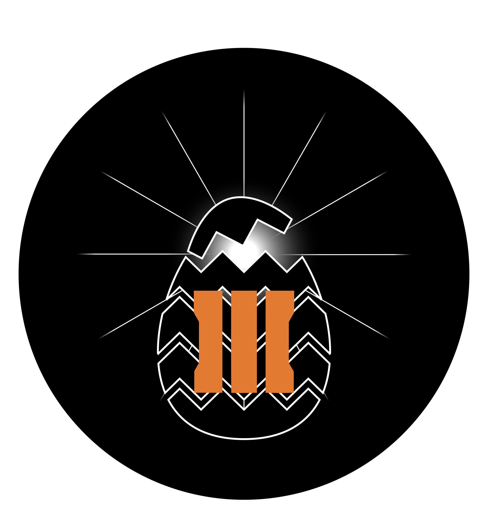
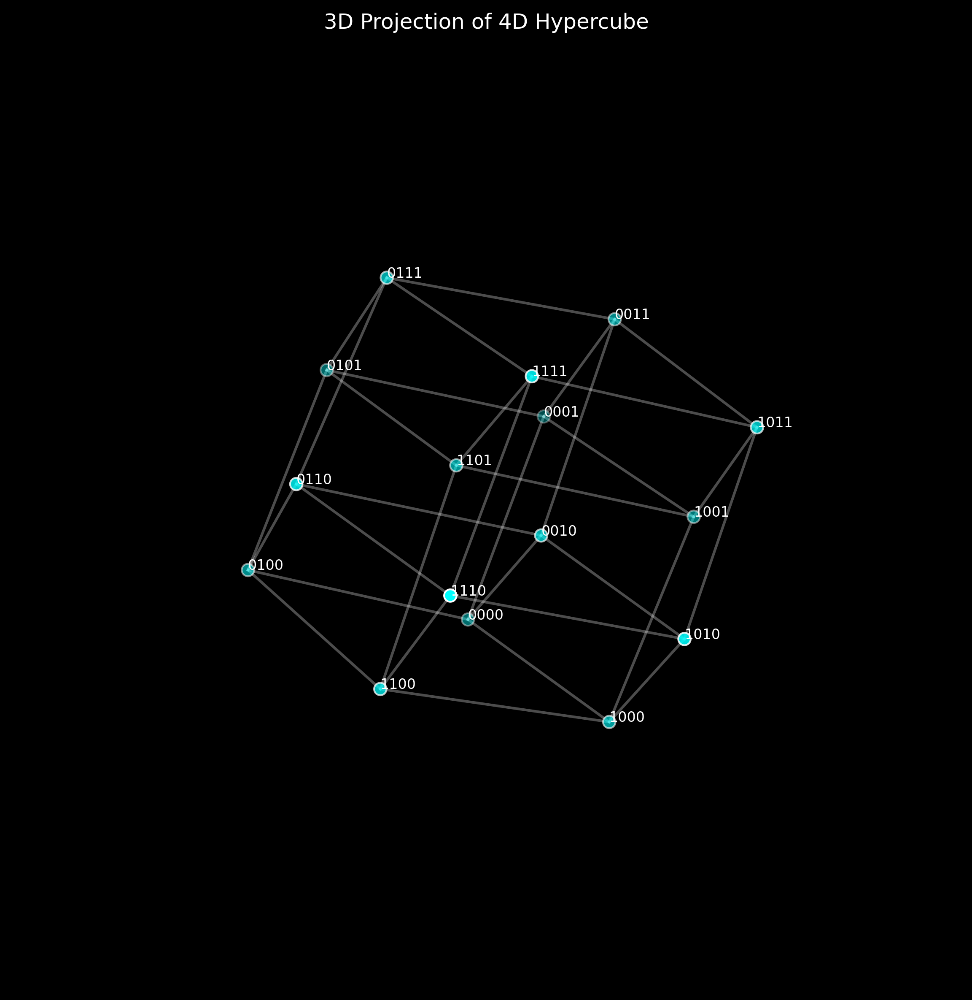
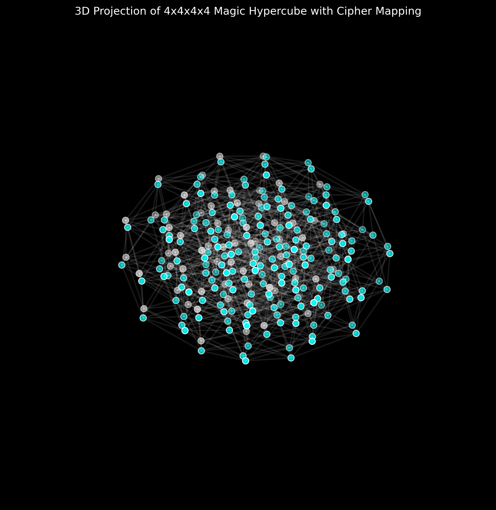

# ImpossibleEEBO3

## Project Overview

This project focuses on the cryptographic analysis and decryption of a cipher from the Call of Duty: Black Ops 3 zombie mode, specifically from "The Giant" map. The cipher has remained unsolved for approximately 8 years and is believed to be encrypted using an unknown method, possibly involving a 4-dimensional magic hypercube. The key "TheGiant" and the weapon name "KN-44" are thought to play crucial roles in the encryption/decryption process. Our goal is to explore various decryption methods and analyze the cipher's structure to uncover its hidden message.

## Background

The cipher is connected to an "impossible" Easter egg teased by developer Jason Blundell. Recent discoveries have linked the cipher to:

- The KN-44 weapon, visible inside a hypercube in a game map.
- The concept of hypercubes in graph theory, often referred to as N-cubes or K-cubes.
- The potential significance of K and N as mathematical variables for whole numbers.
- The idea of magic squares, cubes, and hypercubes in higher dimensions.

It's believed that the encryption method used is either based on existing techniques or a unique combination of known elements, rather than an entirely new method.

## Recent Progress

1. **Cipher Structure Analysis**:
   - Confirmed the cipher text consists of 4 lines with a total of 192 characters.
   - Updated analysis scripts to correctly handle the multi-line structure of the cipher.

2. **Magic Hypercube Characteristics**:
   - Identified key properties of the 4D magic hypercube, including vertex count, edge count, and magic constant.

3. **Enhanced Cipher Analysis**:
   - Conducted detailed analysis of cipher characteristics, including unique character count and character distribution across lines.
   - Performed factor analysis on cipher length and explored relationships with hypercube properties.

4. **Decryption Attempts**:
   - Continued refining decryption strategies based on new insights from cipher and hypercube analysis.

## Key Findings

- Magic Hypercube Characteristics:
  - Dimension: 4
  - Size per Dimension: 4 (based on KN-44 interpretation)
  - Vertex Count: 256
  - Edge Count: 1024
  - Magic Constant: 130
    - The magic constant for a k-dimensional magic hypercube of size n is given by the formula:
      M(k,n) = (n^k * (n^2 - 1)) / (2n)
    - For our 4x4x4x4 hypercube (k=4, n=4): M(4,4) = (4^4 * (4^2 - 1)) / (2*4) = 130
- Cipher Characteristics:
  - Total Length: 192 characters
  - Number of Lines: 4
  - Key: "TheGiant" (8 characters long)

- Relationships and Observations:
  - The cipher length (192) is exactly 3/4 of the hypercube vertex count (256).
  - The number of cipher lines (4) matches the number of hypercube dimensions (4).
  - The key length (8) is twice the hypercube size per dimension (4).
  - The significance of 44 in KN-44 remains to be fully understood in the context of the cipher.
  - The magic constant (130) may play a role in the encryption/decryption process.

## Current Focus

- Analyzing the significance of numerical relationships between cipher characteristics and hypercube properties, particularly the 3/4 ratio of cipher length to vertex count.
- Exploring potential mappings between the 192 cipher characters and the 256 vertices of the hypercube.
- Investigating how the key "TheGiant" might interact with the hypercube properties for encryption/decryption.
- Examining the role of magic squares/cubes/hypercubes in potential encryption methods, particularly focusing on the magic constant of 130.
- Exploring the significance of the number 44 (from KN-44) in the cipher structure or decryption process.
- Investigating how K and N as mathematical variables might relate to the encryption method, considering their role in determining the magic constant.

### Hypercube Visualization

This visualization represents a 3D projection of the 4D hypercube structure we're investigating. The cyan nodes and white edges help us understand the complex relationships between vertices in higher dimensions. Each vertex is labeled with its binary representation.

### Magic Hypercube Visualization

This image shows a 3D projection of the 4D magic hypercube. The cyan nodes represent the first 192 vertices (matching the cipher length), while the white nodes represent the remaining vertices. This visualization may provide insights into how the cipher text maps onto the magic hypercube structure.

## Next Steps

1. Develop a visualization tool to map the 192 cipher characters onto the 256-vertex hypercube, considering the 3/4 ratio.
2. Analyze the distribution of unique characters across the four lines, looking for patterns related to the hypercube's 4D structure.
3. Investigate how the factors of 192 might relate to potential subdivision or traversal patterns within the hypercube structure.
4. Explore encryption/decryption methods that utilize the magic constant 130 and other properties of the 4D magic hypercube.
5. Implement new decryption strategies that leverage the relationship between key length (8), hypercube dimensions (4x4x4x4), and the magic constant (130).
6. Research historical uses of magic squares/cubes in encryption for potential insights, particularly those involving magic constants.
7. Explore how the number 44 might be incorporated into the decryption process, possibly in relation to the magic constant or hypercube properties.
8. Experiment with splitting the key "TheGiant" into two groups of 4 characters and using these subgroups in different ways within the decryption algorithm, potentially in conjunction with the magic constant.
9. Investigate the properties of 4D magic hypercubes where K=4 and N=4, and how they might relate to the cipher structure and the magic constant of 130.
10. Continue to research the KN-44 weapon and other Black Ops 3 elements for additional clues or context that might relate to the magic hypercube properties.

This project continues to evolve as we uncover new insights into the structure of the cipher and its relationship with magic hypercubes. Each analysis brings us closer to understanding the underlying encryption method and ultimately deciphering the hidden message.
